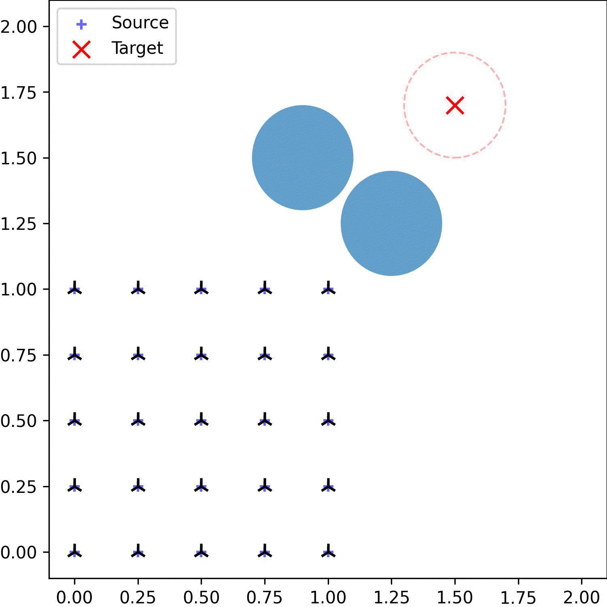

# BlobOT

Python code for the paper **A Blob Method for Mean Field Control with Terminal Constraints** by **Katy Craig**, **Karthik Elamvazhuthi**, and **Harlin Lee**.

## What's inside?

`BlobOT.py` contains the most important class and function definitions for the optimization problem. 
- `Model` is (more or less) a dummy class so that we can leverage the autograd functionality of Pytorch. 
- `KE` calculates the kinetic energy using **velocity** of the trajectories.
- `KE_acc` uses the **acceleration** of trajectories.
- Use `NLE` to calcualte the non-local energy term (without $m_1^2$, so this may be negative) when the target distribution is an empirical distribution. We assume equal weights per particle, but that should be easily modifiable if you need to.
- `NLE_acc` is for the acceleration control example. It needs special treatment to deal with position and velocity becoming a $d+1$-dimensional vector together.
- `NLE_gauss` is the contiuum Gaussian distribution version of `NLE`.
- `NLE_cons` calculates $m_1^2$, the term that's always positive and doesn't affect the optimization problem. For large $N$, it would make sense to modify the code such that this is calculated only once.
- `NLE_pos` and `NLE_acc_pos` come in handy if you want to calculate the non-negative version of the NLE, e.g. for a log-log plot.
- `obstacle` calculates how much cost is incurred by the current trajectory with respect to one circular obstacle.

The following notebooks can be run after cloning this repo and installing Pytorch. Every figure, npz and pkl file created by this repo should be in the `output` folder. If any are missing (such as small_eps_{date}.npz), it's because the file was too large for github. 
- `loss_contour.ipynb`
- `diff_eps.ipynb`: This may produce a different output due to randomness, but it should be qualitatively the same.
- `small_eps.ipynb`: Run this file *after* `diff_eps.ipynb` because this uses the same source and target distributions as the previous experiment.
- `delta_scaling.ipynb`
- `POT_comparison.ipynb`: This may produce a different output due to randomness.
- `continuum_gaussian.ipynb`: The empirical distribution version may produce a different output due to randomness.
- `obstacles.ipynb`
- `acceleration.ipynb`: The shuffled velocity experiment may produce a different output due to randomness.

Helpful tips:
- `blobLoss` and `training_loop` are written so that they are easily adaptable to other examples.
- `z` and `w` are the source and target distributions, respectively.
- `y` denotes $x(1)$, i.e. particle positions at $t=1$.
- Even though we use the method `torch.optim.SGD`, it's actually GD and not SGD.
- `X0` and `X` inside the model is of length $L = 1/\Delta t$ in the time dimension and does **not** include $z = x(0)$. They're of the shape $N \times d \times L$, or `particles` x `dimension` x `time steps`.
- The use of npz vs. pkl is pretty random.
